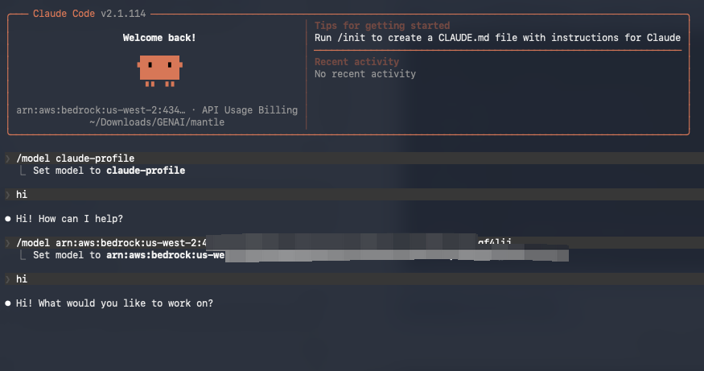
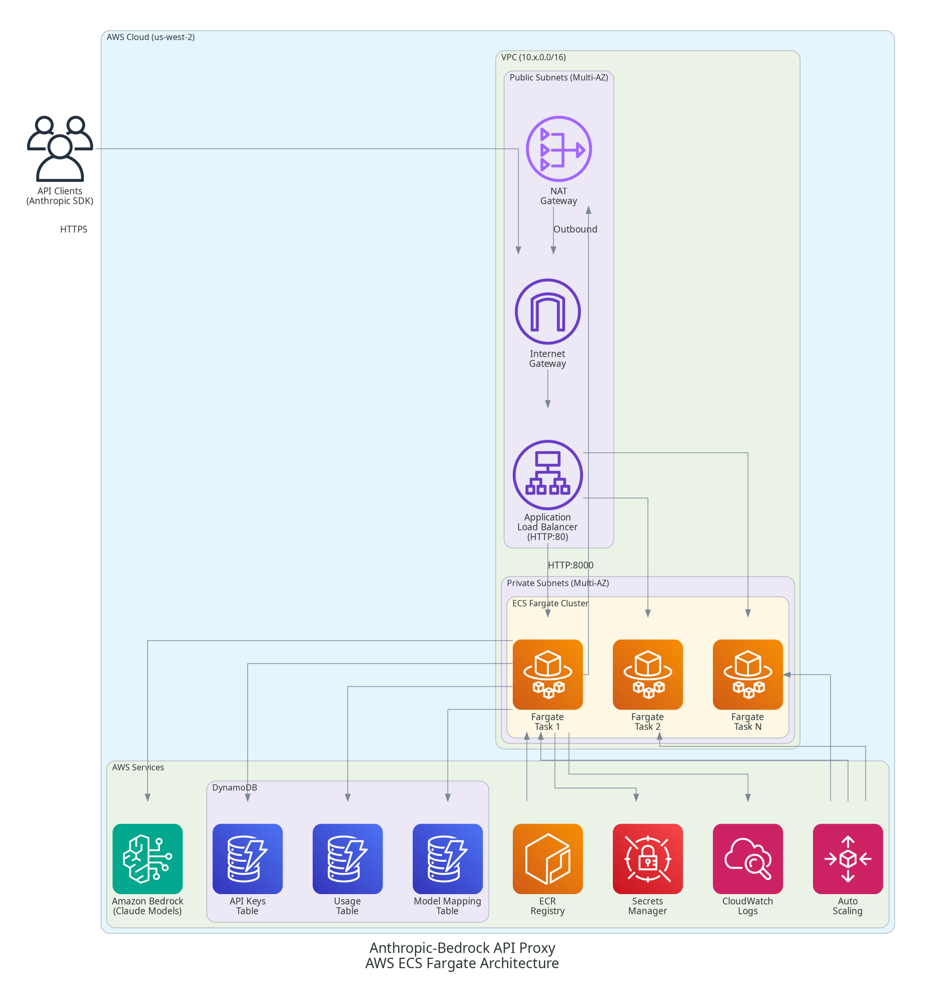

<div align="center">

# 🔄 Bedrock API Proxy

**Zero-Code Migration: Seamlessly Connect Anthropic SDK with AWS Bedrock**

[](LICENSE)
[](https://python.org)
[](https://fastapi.tiangolo.com)
[](https://aws.amazon.com/bedrock/)

<p>
  <a href="./README_ZH.md"></a>
  <a href="./README.md"></a>
  <a href="./cdk/DEPLOYMENT.md"></a>
  <a href="https://aws.amazon.com/cn/blogs/china/programmatic-tool-calling-agent-using-bedrock-and-ecs-docker-sandbox/"></a>
  <a href="https://aws.amazon.com/cn/blogs/china/based-on-amazon-bedrock-implement-dynamic-filtering-web-search-web-fetch/"></a>
</p>

---

</div>

## Overview
> ⚠️ Disclaimer: This project is provided as sample code for demonstration and learning purposes only, and is not intended for production use. Please conduct your own thorough security review, testing, and hardening before deploying to any production environment.

A lightweight API translation service that lets you use various large language models on AWS Bedrock through the Anthropic SDK without modifying your code, while also providing Anthropic-compatible server-side features such as Code Execution, Dynamic Web Search, and PTC. Primarily designed as a proxy for Claude Code / Claude Agent SDK, it includes a visual management web interface for API key distribution, usage monitoring, and quota management. Now with full support for GPT on Bedrock, providing proxy services for Codex.

> 📝 **AWS Global Blog**：[Implementing programmatic tool calling on Amazon Bedrock](https://aws.amazon.com/blogs/machine-learning/implementing-programmatic-tool-calling-on-amazon-bedrock)
>
> 📝 **AWS Chinese Blog**: [Programmatic Tool Calling Agent Using Amazon Bedrock and ECS Docker Sandbox](https://aws.amazon.com/cn/blogs/china/programmatic-tool-calling-agent-using-bedrock-and-ecs-docker-sandbox/)
>
> 📝 **AWS Chinese Blog**: [Implement Dynamic Filtering Web Search and Web Fetch on Amazon Bedrock](https://aws.amazon.com/cn/blogs/china/based-on-amazon-bedrock-implement-dynamic-filtering-web-search-web-fetch/)

**Key Advantages:**
- 🔄 **Zero Code Migration** - Fully compatible with Anthropic API, no code changes required
- 🚀 **Ready to Use** - Supports streaming/non-streaming, tool calling, multi-modal content
- 🤖 **Programmatic Tool Calling** - First proxy to implement Anthropic-compatible PTC API on Bedrock
- 🔍 **Dynamic Web Search** - Supports `web_search_20250305` / `web_search_20260209` with dynamic code filtering
- 🌐 **Web Fetch** - Supports `web_fetch_20250910` / `web_fetch_20260209`, no extra API key required
- 🧠 **GPT Model Proxy** - OpenAI Responses API & Chat Completions API passthrough with proxy-managed web search
- 💰 **Cost Optimization** - Use open-source models on Bedrock to reduce inference costs
- 🔐 **Enterprise-Grade** - API key management, rate limiting, usage tracking, monitoring
- 🔒 **HTTPS Encryption** - Built-in CloudFront HTTPS termination without custom domain
- ☁️ **Cloud-Native** - One-click deployment to AWS ECS with auto-scaling

**Typical Use Cases:** Use **Qwen3-Coder-480B** for code generation in Claude Code, or mix models in **Claude Agent SDK** applications to balance performance and cost.

## Features

### Core
- Full Anthropic Messages API compatibility with bidirectional format conversion
- Streaming (SSE) and non-streaming responses
- Tool use (function calling) with format conversion
- Extended thinking support
- Multi-modal content (text, images, documents)

### Advanced
- **Programmatic Tool Calling (PTC)**: Claude generates and executes Python code in Docker sandbox for tool calling. Supports multi-round execution, `asyncio.gather` parallel calls, and session reuse.
- **Web Search**: Proxy-side `web_search_20250305`/`web_search_20260209` via Tavily or Brave. Domain filtering, search limits, user location. Dynamic filtering version requires Docker.
- **[AgentCore Search MCP Server](agentcore-search-mcp/)**: Standalone MCP server ([PyPI](https://pypi.org/project/agentcore-search-mcp/): `uvx agentcore-search-mcp`) exposing Amazon Bedrock AgentCore Gateway WebSearch to any MCP client (Claude Code, Codex, Cursor) — a local stdio bridge that adds the SigV4 signing the gateway requires. Independent of the proxy; includes a one-shot gateway deployment script.
- **Web Fetch**: Proxy-side `web_fetch_20250910`/`web_fetch_20260209` via httpx (no API key). PDF support. Dynamic filtering version requires Docker.
- **Prompt Cache TTL**: Extends `cache_control` with configurable 1-hour TTL. Three-level priority: API key → request → env default.
- **Beta Header Mapping**: Auto-maps Anthropic beta headers to Bedrock beta headers.
- **Tool Input Examples**: `input_examples` parameter for tool definitions.
- **OpenAI-Compatible API**: Non-Claude models can use Bedrock's OpenAI Chat Completions API (via bedrock-mantle). Maps `thinking` → `reasoning`.
- **OpenAI Passthrough**: `/openai/v1/*` endpoints forward OpenAI SDK requests to Bedrock Mantle. Supports Responses API web search with stateful `previous_response_id`.
- **Service Tier**: Per-key Bedrock service tier (`default`/`flex`/`priority`/`reserved`) with auto-fallback.

### Infrastructure
- API key authentication with DynamoDB storage
- Token bucket rate limiting per API key
- Usage tracking and analytics
- [OpenTelemetry distributed tracing](docs/otel-tracing.md) (Langfuse, Jaeger, Grafana Tempo)
- [Admin Portal](admin_portal/) with Cognito auth for key/usage/pricing management
- [CloudFront HTTPS](docs/cloudfront.md) encryption (optional)

### Supported Models
- Claude 4.5/4.6/4.7/4.8, Claude 4.5 Haiku
- GPT-5.4/5.5
- Qwen3-coder-480b, Qwen3-235b-instruct
- Kimi 2.5, MiniMax 2.5, GLM 4.7/5
- Any Bedrock model supporting Converse API or OpenAI Chat Completions API
- Bedrock **application inference profile ARNs** supported

You can create model ID alias mappings in the Admin Portal, or use ARNs directly.



## Quick Start

### Claude Code Setup

#### 1. Create `~/.claude.json`
```json
{
  "hasCompletedOnboarding": true
}
```

#### 2. Create `~/.claude/settings.json`
```json
{
  "env": {
    "ANTHROPIC_API_KEY": "your_api_key",
    "ANTHROPIC_BASE_URL": "https://your-proxy-url"
  }
}
```

For non-Claude models, add model environment variables:
```json
{
  "env": {
    "ANTHROPIC_API_KEY": "your_api_key",
    "ANTHROPIC_BASE_URL": "https://your-proxy-url",
    "ANTHROPIC_DEFAULT_HAIKU_MODEL": "mooonshotai.kimi-k2.5",
    "ANTHROPIC_DEFAULT_SONNET_MODEL": "mooonshotai.kimi-k2.5",
    "ANTHROPIC_DEFAULT_OPUS_MODEL": "mooonshotai.kimi-k2.5"
  }
}
```

> **Note**: Claude Code/Agent SDK detects direct Bedrock connections and discards beta headers. This proxy disguises the connection to preserve official API behavior.

### Claude Agent SDK

The same settings apply to Claude Agent SDK. See [AgentCore Demo](https://github.com/xiehust/agentcore_demo/tree/main/00-claudecode_agent) for a Dockerfile example.

## Deployment

### Option 1: AWS ECS (Recommended)

| Feature | Fargate (Default) | EC2 |
|---------|-------------------|-----|
| **PTC Support** | No | Yes |
| **Management** | Serverless | Requires ASG |
| **Docker Access** | No | Yes (socket mount) |
| **Recommended For** | Standard API proxy | PTC/Web Search dynamic filtering |

```bash
cd cdk && npm install

# Fargate (ARM64)
./scripts/deploy.sh -e prod -r us-west-2 -p arm64

# EC2 (enables PTC + dynamic filtering)
./scripts/deploy.sh -e prod -r us-west-2 -p arm64 -l ec2

# With all features
ENABLE_CLOUDFRONT=true \
ENABLE_WEB_SEARCH=true \
WEB_SEARCH_PROVIDER=tavily \
WEB_SEARCH_API_KEY=tvly-your-key \
ENABLE_OPENAI_COMPAT=true \
BEDROCK_API_KEY=your-bedrock-key \
MANTLE_ENDPOINT_URL=https://bedrock-mantle.us-east-2.api.aws/openai/v1 \
./scripts/deploy.sh -e prod -r us-west-2 -p arm64 -l ec2
```

Deployment takes ~15-20 minutes. See [CDK Deployment Guide](cdk/DEPLOYMENT.md) for full details. For AgentCore web search, run `AWS_REGION=us-east-1 uv run bash scripts/create_agentcore.sh` in `us-east-1`, then deploy with `WEB_SEARCH_PROVIDER=agentcore` and `AGENTCORE_GATEWAY_URL=<gateway-mcp-url>` instead of `WEB_SEARCH_API_KEY`.

#### Post-Deployment

```bash
# Create admin user
./scripts/create-admin-user.sh -e prod -r us-west-2 --email admin@example.com

```

visit https://xxx.cloudfront.net/admin/ Admin portal to config api keys

### Option 2: Local Development

```bash
# Install
pip install uv && uv sync
cp .env.example .env  # configure

# Setup DynamoDB tables and create API key
uv run scripts/setup_tables.py
uv run scripts/create_api_key.py --user-id dev-user --name "Dev Key"

# Run
uv run uvicorn app.main:app --reload --port 8000
```

## API Usage

### Anthropic SDK

```python
from anthropic import Anthropic

client = Anthropic(
    api_key="sk-your-api-key",
    base_url="http://localhost:8000"
)

# Non-streaming
message = client.messages.create(
    model="claude-opus-4-7",
    max_tokens=1024,
    messages=[{"role": "user", "content": "Hello!"}]
)
print(message.content[0].text)

# Streaming
with client.messages.stream(
    model="claude-opus-4-7",
    max_tokens=1024,
    messages=[{"role": "user", "content": "Tell me a story"}]
) as stream:
    for text in stream.text_stream:
        print(text, end="", flush=True)
```

### curl

```bash
# Non-streaming
curl http://localhost:8000/v1/messages \
  -H "Content-Type: application/json" \
  -H "x-api-key: sk-xxx" \
  -d '{"model": "claude-sonnet-4-5-20250929", "max_tokens": 1024, "messages": [{"role": "user", "content": "Hello!"}]}'

# Streaming
curl http://localhost:8000/v1/messages \
  -H "Content-Type: application/json" \
  -H "x-api-key: sk-xxx" \
  -d '{"model": "claude-sonnet-4-5-20250929", "max_tokens": 1024, "stream": true, "messages": [{"role": "user", "content": "Hello!"}]}'

# List models
curl http://localhost:8000/v1/models -H "x-api-key: sk-xxx"
```

### OpenAI SDK (`/openai/v1`)

Requires `ENABLE_OPENAI_PASSTHROUGH=True` on the proxy. Point the OpenAI SDK at `<proxy>/openai/v1` and use your **proxy API key** — the proxy supplies the upstream Bedrock credentials. Bedrock model IDs (e.g. `openai.gpt-oss-120b`) are passed through; Anthropic-style aliases are resolved via the model mapping table.

#### Codex CLI / IDE

Codex can use the proxy as a custom Responses API model provider. Put the provider settings in your user-level `~/.codex/config.toml` because Codex ignores model provider settings from project-local `.codex/config.toml` files.

```toml
model_provider = "bedrock-proxy"
model = "openai.gpt-5.5"
model_reasoning_effort = "high"

# Recommended when the proxy has no Tavily/Brave web-search provider configured.
# Codex's default cached web search sends external_web_access=false, which this
# proxy does not support.
# If proxy-side web search is enabled, set web_search to "live".
web_search = "disabled"

[model_providers.bedrock-proxy]
name = "Bedrock API Proxy"
base_url = "https://your-proxy.example.com/openai/v1"
env_key = "OPENAI_API_KEY"
wire_api = "responses"
```

Set `OPENAI_API_KEY` to a proxy API key, not a Bedrock API key:

```bash
export OPENAI_API_KEY="sk-your-proxy-api-key"
```

If you want Codex web search through the proxy, configure `ENABLE_WEB_SEARCH=True` plus `WEB_SEARCH_PROVIDER`/`WEB_SEARCH_API_KEY` on the proxy service, then set:

```toml
web_search = "live"
```

#### Chat Completions API

```python
from openai import OpenAI

client = OpenAI(
    api_key="sk-your-api-key",
    base_url="http://localhost:8000/openai/v1",
)

# Non-streaming
resp = client.chat.completions.create(
    model="openai.gpt-oss-120b",
    messages=[{"role": "user", "content": "Hello!"}],
)
print(resp.choices[0].message.content)

# Streaming — set stream_options to capture usage
stream = client.chat.completions.create(
    model="openai.gpt-oss-120b",
    messages=[{"role": "user", "content": "Tell me a story"}],
    stream=True,
    stream_options={"include_usage": True},
)
for chunk in stream:
    if chunk.choices and chunk.choices[0].delta.content:
        print(chunk.choices[0].delta.content, end="", flush=True)
```

#### Responses API

Supports stateful conversation chaining via `previous_response_id` and proxy-managed `web_search` tool calls.

```python
from openai import OpenAI

client = OpenAI(
    api_key="sk-your-api-key",
    base_url="http://localhost:8000/openai/v1",
)

# Basic call
resp = client.responses.create(
    model="openai.gpt-oss-120b",
    input="What's the capital of France?",
)
print(resp.output_text)

# Stateful follow-up using previous_response_id
followup = client.responses.create(
    model="openai.gpt-oss-120b",
    input="And its population?",
    previous_response_id=resp.id,
)
print(followup.output_text)

# Streaming
stream = client.responses.create(
    model="openai.gpt-oss-120b",
    input="Write a haiku about Bedrock",
    stream=True,
)
for event in stream:
    if event.type == "response.output_text.delta":
        print(event.delta, end="", flush=True)

# Web search (proxy-managed via Tavily/Brave)
resp = client.responses.create(
    model="openai.gpt-oss-120b",
    input="What were the top AI announcements this week?",
    tools=[{"type": "web_search"}],
)
print(resp.output_text)
```

## Architecture

```
+----------------------------------------------------------+
|              Client Application                          |
|           (Anthropic Python SDK)                         |
+---------------------------+------------------------------+
                            |
                            | HTTP/HTTPS (Anthropic Format)
                            v
+----------------------------------------------------------+
|          FastAPI API Proxy Service                       |
|                                                          |
|  +----------+  +-----------+  +----------------+         |
|  |   Auth   |  |   Rate    |  |   Format       |         |
|  |Middleware|->| Limiting  |->|  Conversion    |         |
|  +----------+  +-----------+  +----------------+         |
+-------+---------------+---------------+------------------+
        |               |               |
        v               v               v
  +----------+    +----------+    +----------+
  | DynamoDB |    |   AWS    |    |CloudWatch|
  |          |    | Bedrock  |    |   Logs/  |
  | API Keys |    | Runtime  |    | Metrics  |
  |  Usage   |    | Converse |    |          |
  +----------+    +----------+    +----------+
```

### Routing Logic
- Model contains "anthropic" or "claude" → **InvokeModel API** (native format)
- `ENABLE_OPENAI_COMPAT=true` → **OpenAI Chat Completions** (via bedrock-mantle)
- Otherwise → **Converse API** (unified Bedrock API)
- `/openai/v1/*` → **OpenAI Passthrough** (independent routes)

### ECS Production Architecture



| Component | Description |
|-----------|-------------|
| **VPC** | Multi-AZ with public/private subnets |
| **ALB** | Receives external HTTP/HTTPS traffic |
| **ECS Cluster** | Fargate or EC2 in private subnets |
| **CloudFront** | Optional HTTPS termination |
| **DynamoDB** | API Keys, Usage, Model Mapping (PAY_PER_REQUEST) |
| **Auto Scaling** | CPU/memory-based (min 2, max 10) |

## Documentation

| Document | Description |
|----------|-------------|
| [Configuration Reference](docs/configuration.md) | All environment variables and settings |
| [CDK Deployment Guide](cdk/DEPLOYMENT.md) | Full ECS deployment instructions |
| [CloudFront HTTPS](docs/cloudfront.md) | HTTPS encryption setup |
| [OpenTelemetry Tracing](docs/otel-tracing.md) | LLM observability with Langfuse/Jaeger |
| [Service Tier](docs/service-tier.md) | Cost/latency tier configuration |
| [Architecture Details](docs/architecture/detailed-flows.md) | Conversion flows, streaming, DynamoDB schemas |
| [Features](docs/architecture/features.md) | Detailed feature documentation |
| [Troubleshooting](docs/troubleshooting.md) | Common errors and debugging |
| [Model Mapping](docs/MODEL_MAPPING.md) | Model ID mapping reference |
| [AgentCore Search MCP Server](agentcore-search-mcp/README.md) | Standalone MCP server for AgentCore Gateway WebSearch ([中文](agentcore-search-mcp/README_ZH.md), [agent install steps](agentcore-search-mcp/INSTALL_FOR_AGENTS.md)) |

## Security

### Best Practices
- Use environment variables or Secrets Manager for API keys
- Use IAM roles on AWS (ECS task role)
- Enable CloudFront for HTTPS encryption
- Configure rate limits per API key
- Use VPC endpoints for AWS services in production

### Required IAM Permissions

```json
{
  "Version": "2012-10-17",
  "Statement": [
    {
      "Effect": "Allow",
      "Action": [
        "bedrock:InvokeModel",
        "bedrock:InvokeModelWithResponseStream",
        "bedrock:ListFoundationModels",
        "bedrock:GetFoundationModel"
      ],
      "Resource": "*"
    },
    {
      "Effect": "Allow",
      "Action": [
        "dynamodb:PutItem",
        "dynamodb:GetItem",
        "dynamodb:UpdateItem",
        "dynamodb:Query",
        "dynamodb:Scan",
        "dynamodb:DeleteItem"
      ],
      "Resource": ["arn:aws:dynamodb:*:*:table/anthropic-proxy-*"]
    }
  ]
}
```

## Development

```bash
# Tests
uv run pytest                           # all tests
uv run pytest --cov=app --cov-report=html  # with coverage
uv run pytest -m integration            # integration only

# Code quality
black app tests && ruff check app tests && mypy app
```

## Contributing

Contributions are welcome! Please fork, create a feature branch, add tests, and submit a pull request.

## License

MIT-0
